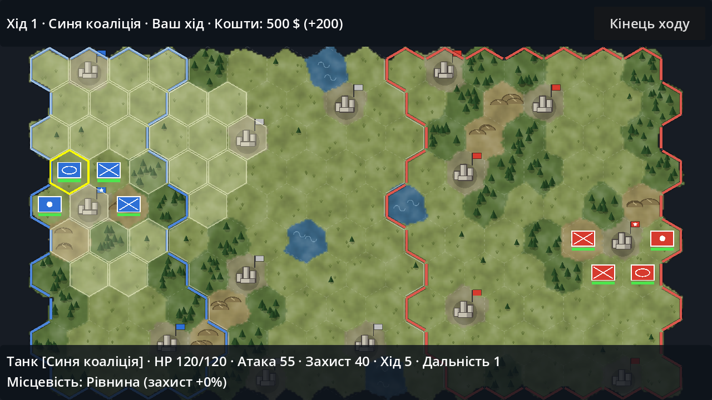

# Frontline: Modern War

Покрокова стратегія для Android у сучасному сеттингу (натхненна European War 7).
Концепція і план розробки — у [docs/GDD.md](docs/GDD.md).



## Поточний стан — крок 2: прототип + автоматична збірка APK

- Карта в стилі European War 7: суцільна мальована місцевість, ледь помітна пунктирна сітка
  та кольорові кордони територій (симетрична для чесної гри): рівнини, ліси, пагорби, вода, міста.
- 5 юнітів: **Піхота, Танк, САУ, ППО, Дрон** (позначки у стилі тактичних знаків НАТО).
- Рух з урахуванням місцевості, зона контролю противника, бій з контратакою, захист від місцевості.
- Захоплення міст → дохід, мобілізація нових військ у своїх містах, лікування в містах.
- Противник під керуванням ІІ. Перемога — захоплення ворожої столиці (★).

### Прототип-пісочниця (зараз увімкнена)

Без противника: ви керуєте юнітами **обох** сторін, будь-який юніт може атакувати будь-який
інший (навіть свій), юніти **безсмертні** (здоров'я не падає нижче 1), перемоги немає.
«Кінець ходу» відновлює ходи всім юнітам. Перемикач — `sandbox` у `scripts/game.gd`;
автотест завжди грає звичайну гру ІІ проти ІІ.

Вимоги до моделей юнітів — [docs/unit_model_requirements.md](docs/unit_model_requirements.md).

### Керування

- Тап по юніту — вибір; білі гекси — куди можна піти, червоні — кого можна атакувати.
- Тап по білій клітинці — лінія маршруту й кнопки «Рух (N кл.)» / «Скасувати»;
  «Рух» (або повторний тап по тій самій клітинці) — юніт їде клітинка за клітинкою.
- Тап по своєму порожньому місту — меню мобілізації.
- Перетягування — рух карти, два пальці (або колесо миші) — масштаб.

## Як запустити

1. Встановіть [Godot 4.3](https://godotengine.org/download) (стандартна версія, не .NET).
2. Відкрийте Godot → Import → виберіть `project.godot` з цієї папки.
3. Натисніть F5 — гра запуститься на комп'ютері (миша імітує дотики).

### Встановити на телефон (без комп'ютера)

Після кожної зміни коду GitHub лише запускає автотест. APK збирається **тільки вручну**
(вкладка Actions → «Android APK» → Run workflow) — Claude питає дозволу перед кожною збіркою.
Після збірки:

1. Відкрийте на телефоні сторінку **Releases** репозиторію → «Остання збірка».
2. Завантажте `frontline.apk` і відкрийте його.
3. Якщо Android попросить — дозвольте встановлення з цього джерела (браузера/файлового менеджера).

Нові збірки підписані тим самим ключем (`tools/debug.keystore`), тож встановлюються поверх старої
без видалення. Це **налагоджувальний** ключ — для Google Play пізніше створимо окремий секретний.

### Зібрати APK самостійно

```
GODOT=/шлях/до/godot ANDROID_SDK_ROOT=/шлях/до/android-sdk tools/build_android.sh
```

Потрібні: Godot 4.3 з шаблонами експорту, Android SDK (build-tools), JDK 17.

## Автотест

Грає 5 партій ІІ проти ІІ без графіки й перевіряє, що немає помилок:

```
godot --headless --path . -- --autotest
```

## Структура

- `scripts/hex.gd` — математика гексагональної сітки
- `scripts/rules.gd` — характеристики місцевості та юнітів (баланс)
- `scripts/unit.gd` — стан юніта
- `scripts/game.gd` — логіка гри, ввід, малювання юнітів
- `scripts/map_view.gd` — малювання карти: місцевість, сітка, кордони, міста
- `scripts/enemy_ai.gd` — штучний інтелект
- `scripts/hud.gd` — інтерфейс
