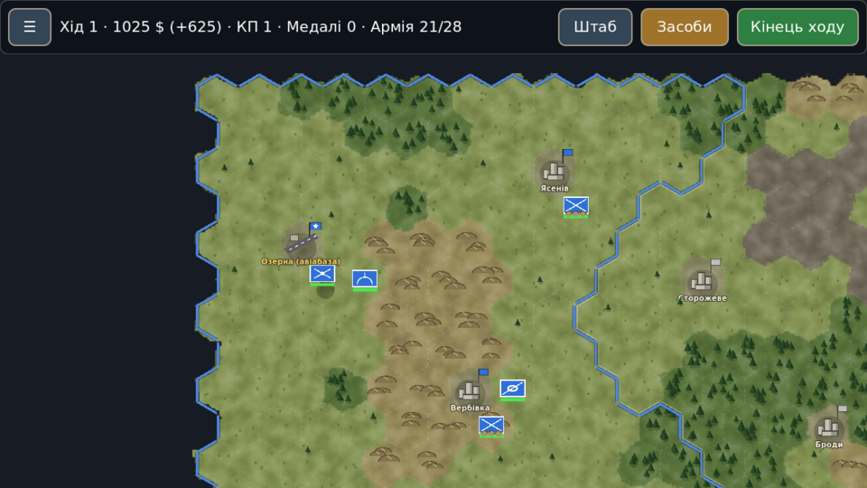

# Hexfront: Modern War


Назва гри — **Hexfront** (раніше робоча назва Frontline). Іконка й шари для Android — у
[`assets/branding/`](assets/branding/). Технічний ідентифікатор пакета `com.frontline.modernwar`
і файл `frontline.apk` не змінювались, щоб встановлена версія оновлювалась без перевстановлення.

Покрокова стратегія для Android у сучасному сеттингу: аналог Glory of Generals 3 / European War 7
з сучасною технікою. Канон правил — [docs/Game_Concept_Handoff_UA_v1.0.md](docs/Game_Concept_Handoff_UA_v1.0.md).



## Поточний стан — v0.3: глобальна кампанія

- **Одна кампанія на глобальній карті** 44×26 (`assets/maps/global.json`, генератор
  `tools/maps/make_global.py`): річка з мостами, гірський хребет із перевалом, озеро, ліси, пагорби,
  33 міста з назвами, аеродроми. Без ліміту ходів. Мета — захопити всі ключові точки противника
  (столиця й головна авіабаза, прапор із зіркою).
- **10 сучасних юнітів:** піхота, бронемашина, БМП, танк, САУ, РСЗВ, ППО, логістика, ударний
  вертоліт, штурмовик. Класи цілей (піхота / легка / важка / вертоліт / літак), контратака за каноном,
  перехоплення авіації ППО, площинний удар РСЗВ (і по своїх), ремонт логістикою.
- **Механіки з §38 канону:** командири (наймання й підвищення в «Штабі» за медалі, призначення
  юніту, навички з 3-го рангу), ветеранство (до 3 зірок), окопування піхоти, оперативні засоби за очки
  командування (ракетний удар, польовий ремонт, резерв).
- **Економіка:** гарантований базовий дохід + міста, армійський ліміт зі штрафом до доходу
  (§16.3), купівля в містах, авіація — на аеродромах.
- ШІ противника: засоби, охорона позицій, ремонт, захоплення, виробництво в межах ліміту.
- Головне меню, довідка «Як грати», автозбереження на початку кожного ходу (§23.3).

Код: `scripts/app.gd` — меню; `scripts/game.gd` — кампанія (клас `Battle`); `scripts/rules.gd` —
усі числа балансу; `scripts/enemy_ai.gd` — ШІ; `scripts/hud.gd`, `scripts/ui_kit.gd` — інтерфейс.
Шрифт — DejaVu Sans (`assets/fonts`, вільна ліцензія).

Вимоги до моделей юнітів — [docs/unit_model_requirements.md](docs/unit_model_requirements.md).

## Як запустити

1. Встановіть [Godot 4.3](https://godotengine.org/download) (стандартна версія, не .NET).
2. Відкрийте Godot → Import → виберіть `project.godot` з цієї папки.
3. Натисніть F5 — гра запуститься на комп'ютері (миша імітує дотики).

### Встановити на телефон (без комп'ютера)

Після кожної зміни коду GitHub лише запускає автотест. APK збирається **тільки вручну**
(вкладка Actions → «Android APK» → Run workflow) — Claude питає дозволу перед кожною збіркою.
Після збірки:

1. Відкрийте на телефоні сторінку **Releases** репозиторію → «Остання збірка».
2. Завантажте `frontline.apk` і відкрийте його.
3. Якщо Android попросить — дозвольте встановлення з цього джерела (браузера/файлового менеджера).

Нові збірки підписані тим самим ключем (`tools/debug.keystore`), тож встановлюються поверх старої
без видалення. Це **налагоджувальний** ключ — для Google Play пізніше створимо окремий секретний.

### Зібрати APK самостійно

```
GODOT=/шлях/до/godot ANDROID_SDK_ROOT=/шлях/до/android-sdk tools/build_android.sh
```

Потрібні: Godot 4.3 з шаблонами експорту, Android SDK (build-tools), JDK 17.

## Автотест

Грає дві повні кампанії ІІ проти ІІ без графіки, після кожної перевіряє збереження/завантаження:

```
godot --headless --path . -- --autotest
```

## Скріншоти для перевірки

```
xvfb-run godot --path . --rendering-driver opengl3 --resolution 1280x720 \
  --script res://tools/screenshots/take.gd -- /шлях/до/папки
```
