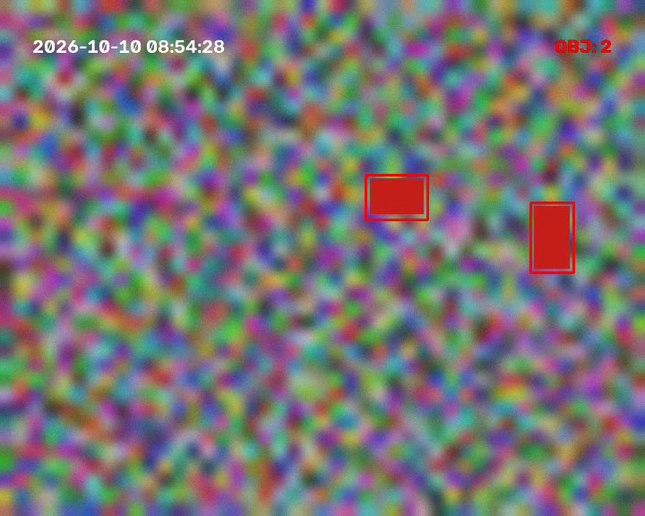

# Vigil — аналоговий монітор спостереження з детекцією руху

Відео з аналогової FPV-камери проходить через Raspberry Pi 4 і виводиться на аналоговий
монітор. Рухомі об'єкти в кадрі обводяться рамкою, коли з'являється новий об'єкт, звучить сигнал.

```
FPV-камера ─CVBS─► ADV7280-M ─CSI─► Raspberry Pi 4 ─CVBS─► аналоговий монітор
     │                                   ├─ GPIO17 ─► зумер
     └──────────── реле обходу ◄─────────┴─ GPIO27     (при збої — камера напряму на монітор)
```



## Можливості

- Детекція рухомих об'єктів відніманням фону (MOG2) для нерухомої камери.
- Трекер: рамка з'являється, лише коли об'єкт видно кілька кадрів поспіль (відсіює шум
  аналогового сигналу), і тримається, поки об'єкт у кадрі.
- Зони ігнорування (дерева, трава), мінімальний розмір об'єкта.
- Написи на екрані: дата й час, кількість об'єктів, `NO SIGNAL`, стан навчання фону.
- Зумер: сигнал на кожен новий об'єкт або переривчастий, поки є об'єкти.
- Реле обходу: якщо програма зупинилась або зависла, монітор отримує картинку з камери напряму.
- PAL і NTSC.
- Захоплення, детекція й виведення працюють в окремих потоках — повільна детекція не гальмує відео.

## Залізо та налаштування Pi

Див. [docs/raspberry_pi_setup.md](docs/raspberry_pi_setup.md): компоненти, схема підключення
реле й зумера, налаштування композитного виходу і декодера, автозапуск.

## Запуск на ПК (розробка)

```bash
python3 -m venv .venv
.venv/bin/pip install -e ".[dev]"

# Обробити відеофайл і записати результат (те, що було б на моніторі)
.venv/bin/python -m vigil --source video.mp4 --display file --out output/result.avi --virtual-gpio

# У вікні, в реальному темпі (потрібен opencv-python замість opencv-python-headless)
.venv/bin/python -m vigil --source video.mp4 --display window --realtime --virtual-gpio

# Тести
.venv/bin/python -m pytest -q
```

Параметри — у [config.example.yaml](config.example.yaml) (`-c config.yaml`).

## Структура

| Файл | Призначення |
|---|---|
| `vigil/config.py` | конфігурація та її перевірка |
| `vigil/source.py` | захоплення відео (V4L2 / файл / потік), фоновий потік захоплення |
| `vigil/preprocess.py` | деінтерлейс, зменшення, знешумлення; перевірка наявності сигналу |
| `vigil/motion.py` | віднімання фону, зони ігнорування, захист від різкої зміни сцени |
| `vigil/tracker.py` | зіставлення об'єктів між кадрами |
| `vigil/pipeline.py` | детектор: збирає все в стан «які об'єкти де» |
| `vigil/overlay.py` | рамки й написи |
| `vigil/display.py` | виведення: кадровий буфер (композит Pi), вікно, файл |
| `vigil/gpio.py` | зумер і реле обходу |
| `vigil/app.py` | застосунок: потоки, зв'язок усіх частин |
| `vigil/events.py` | (опційно) журнал подій і знімки |
| `tests/` | тести на синтетичному «аналоговому» відео |
