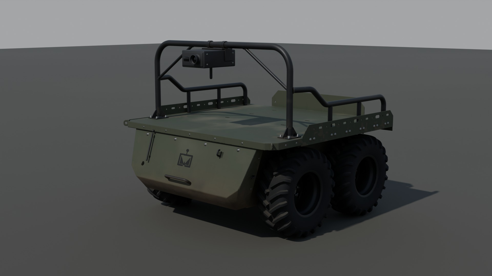

# НРК «Змій Логістичний» (Rovertech, 2026) — 3D-модель

Hero-asset (поки без LOD), зібраний процедурно скриптами Blender з нуля. **З v13 модель робиться для іншої
гри з камерою середньої дистанції** (не для спрайтів Frontline: Modern War): помірна деталізація, бюджет
~100–150 тис. трикутників + LOD, дрібниці згодом — у normal map (див. `HANDOFF.md`). Габарити взято з 3D-моделі
пожежної версії «Змія» на ArtStation (кадри облету й рендери, надані власником проєкту). Трубчастих
надбудов, відкидного борту, фаркопа, логотипів і дрібних деталей носа немає — за вимогою власника;
далі модель розвивається як **власний дизайн**, без прив'язки до оригіналу. Матеріали поки прості,
однотонні (див. «Матеріали»).
Перевірено на **Blender 4.5.14 LTS** і **Blender 5.2** (модуль `bpy` 5.2.2).



| Файл | Що це |
|---|---|
| `zmiy_logistic.blend` | сцена: модель, модулі (сховані), колізії |
| `zmiy_logistic.fbx` | модель + колізії `UCX_*` (Unreal) |
| `zmiy_logistic.glb` | модель для Godot / веб |
| `zmiy_logistic_modules.glb` | опційні модулі в тих самих координатах: Starlink Mini, вантаж |
| `renders/` | рендери: 3/4 спереду, збоку, спереду, згори, ззаду, знизу, з модулями |
| `zmiy_build.py` | геометрія й ієрархія (усі розміри — словник `P` на початку) |
| `zmiy_texture.py` | UV-розгортка; у режимі `full` — запікання масок і текстури зі зносом |
| `zmiy_export.py` | експорт `.blend/.fbx/.glb` і рендери |
| `zmiy_wheel_hp.py` | **детальне колесо** (high-poly) → `zmiy_wheel_high.blend` (не в git, ~10 с); прев'ю — `previews/wheel_high.jpg` |
| `zmiy_wheel_lp.py` | **легке колесо** моделі (~12,3 тис. трикутників, власна UV); `-- bake [2048]` — запікання з детального → `textures/`; `-- wear` — знос (пил, бруд, відколи, іржа) |
| `textures/Zmiy_Wheel_*.png` | текстури колеса (2048): BaseColor, ORM, Roughness, Metallic — зі зносом; Normal (OpenGL), AO — запечені; маски `Mask_ID`, `Mask_Edge` |
| `viewer/` | інтерактивний 3D-перегляд (three.js) зі студійним і реалістичним (HDRI) освітленням, публікується як сторінка claude.ai — див. `viewer/README.md` |
| `HANDOFF.md`, `PROMPT.md` | передача роботи іншому ШІ/розробнику |

## Як перезібрати

```
blender -b --factory-startup --python zmiy_build.py --python zmiy_texture.py --python zmiy_export.py
```

- Тільки геометрія з простими матеріалами: відкрити `zmiy_build.py` у Blender → Scripting → Run Script.
- `ZMIY_TEX_MODE=full` — увімкнути запікання й процедурні текстури зі зносом (за замовчуванням `simple`:
  лише UV і однотонні матеріали). Карти пишуться в `textures/`. Роздільність — `TEX_RES` у `zmiy_texture.py`
  (`ZMIY_TEX_SCALE=0.5` для перевірки).
- Колесо: `blender -b --factory-startup --python zmiy_wheel_hp.py` (детальне → `zmiy_wheel_high.blend`), потім
  `blender -b --factory-startup --python zmiy_wheel_lp.py -- bake 2048` (чисті карти й маски, ~10 хв) і
  `... -- wear` (знос поверх масок, ~1 хв; `bake` перезаписує BaseColor/ORM чистими — після нього завжди `wear`).
  Сила зносу — `WEAR = dict(dust, mud, chips, rust)` у `zmiy_wheel_lp.py` (0 — чисто, 1 — як зараз).
- `ZMIY_MASK_CACHE=_cache` (режим `full`) зберігає запечені маски; після правок геометрії кеш треба видалити.
- `ZMIY_SAMPLES`, `ZMIY_RES_PCT` — якість/розмір рендерів, `ZMIY_NO_RENDER=1` — без рендерів.
- Лише рендери з готового файлу: `ZMIY_NO_EXPORT=1 ZMIY_VIEWS=front34,side blender -b zmiy_logistic.blend --python zmiy_export.py`.
- Прогін на 4 ядрах CPU без GPU: збірка й експорт ~1 хв, рендери ~20 хв (Cycles, 160 семплів);
  режим `full` додає ~35 хв запікання.

## Ієрархія, осі, масштаб

```
Zmiy_Logistic            empty на землі під центром кузова, (0, 0, 0)
├─ Hull                  корпус разом із носом — одна зварна деталь: короб між колесами, лобовий лист, ребра,
│                        фланці під піддон, бобишки моторів-коліс, люки, шви; півот (0, 0, 0)
├─ Rear                  корма: поличка, задня панель на болтах і сервісна панель; півот на задній стінці (0, −0,891, 0,450)
├─ FrontGuard            накладна захисна плита спереду; півот на її задній площині (0, 0,815, 0,677)
├─ Deck                  піддон-палуба — окрема знімна деталь; півот на площині кріплення (0, 0, 0,858)
├─ Wheel_FL / FR / RL / RR   півот у центрі колеса, обертання навколо локальної X; ліві повернуті на 180° навколо Z
├─ Module_Starlink / Module_Cargo   сховані опційні модулі
└─ UCX_Zmiy_Logistic_00…07   прості опуклі колізії (колекція Zmiy_Collision)
```

- Blender: **X праворуч, Y вперед (ніс), Z вгору**, 1 юніт = 1 м, земля на Z = 0.
- glTF: ніс дивиться в −Z (це «вперед» у Godot). FBX: експорт з `-Z forward, Y up`.
- Один меш колеса (`Zmiy_Wheel`) на 4 об'єкти; ліві — **поворот на 180°**, не дзеркало (написи на боковині читаються).

## Розміри (м)

**Як виміряно.** Масштаб дає шина: на боковині читається маркування KABAT **10.0/75-15.3**
(зовнішній Ø 0,77 м). По кадрах облету (вид збоку, спереду, ззаду) розв'язано спільну задачу
«камера орбіти + габарити» за ~35 точками (маточини, кути бортових стінок, кути лобового листа,
кути кормового борту, силуети шин). Поздовжні розміри й висоти — з майже ортографічного
бічного рендера. Потім контур готової моделі накладено на кадри референсу з тих самих камер:
колеса, стінки, ніс і корма збігаються з точністю ~1–2 см.

| Параметр | Попередня версія | Зараз (з референсу) |
|---|---|---|
| Ширина по бортових стінках | 1,56 | **1,23** |
| Ширина по шинах (колія по зовнішніх краях) | 1,52 | **1,41** (центри коліс X ±0,557) |
| Ширина нижнього корпусу між колесами | 0,91 | **0,73** |
| Довжина (задній край палуби → захисна плита) | 1,63 | **1,88** (1,85 без плити) |
| Колісна база | 0,75 | **0,873** |
| Колесо Ø / ширина шини | 0,65 / 0,245 | **0,77 / 0,287** (KABAT 10.0/75-15.3, обід 15,3″) |
| Палуба / верх бортових стінок | 0,745 / 0,83 | **0,862 / 0,99** |
| Габаритна висота | 1,38 (з дугою) | **1,05** по вушках для крана (0,99 — верх бортових стінок) |
| Кліренс під корпусом / під носом | 0,23 / 0,25 | **0,29 / 0,29** |
| Лобовий лист: ширина | 1,28 / — / 1,12 | **0,73** по всій висоті (у лінію з бортами корпусу), без крил (v20) |

Тепер шини виступають за бортові стінки на ~8 см з кожного боку, як на референсі; кузов
вужчий за колію і довший — пропорції ширина : довжина ≈ 0,66 замість 0,96.
Для порівняння: у пресі для платформи «Змій» наводять 2,15 × 1,5 м і колеса 75 см (ймовірно, з навісним
обладнанням) — колеса й ширина з цим узгоджуються.

## Конструкція

- **Нижній корпус** — вузький короб між колесами (0,73 м), закритий зверху, з вертикальними ребрами
  жорсткості на бортах і бобишками моторів-коліс; дно рівне (захисного листа немає — рішення власника, v18). По верху бортів —
  фланці 35 × 6 мм, на які лягає піддон; ребра корпусу підпирають фланці знизу. Ребра (40 мм, `P['rib_y']`) —
  **суцільні** від низу до фланця (v20) і оминають бобишки моторів-коліс щонайменше на 18 мм.
  - **Сервісні люки** на обох бортах між колесами (кришки 280 × 160 мм, радіус кутів 25 мм, 8 болтів M6) —
    доступ до контролерів моторів. Стоять посередині проміжку між шинами й угорі, де він ширшає: кришка й
    болти поза контуром шин (≥ 29 мм, вид збоку), тож **кришку знімають, не знімаючи коліс** — головку
    ключа подають прямо в проміжок (за колесами до борту лише 4,8 см). Збірка друкує цей запас.
  - **Скіс заднього низу 15 × 15 см** — рампа при русі заднім ходом через колоду/камінь між колесами
    (як нижній лист носа спереду); нижня задня панель піднята над ним.
  - На торцях бобишок моторів — гумові ущільнення до маточини колеса (між ротором і статором робочий зазор 1,5 мм).
  - Борт зварений із двох листів — **стиковий шов** на висоті 0,569 м; під ребрами шов зачищено врівень
    із листом (ребро суцільне), валик видно між ребрами. Кутові шви (валик Ø5,6 мм): ребра, фланці, кільцеві — навколо бобишок моторів.
- **Піддон-палуба (`Deck`)** — окрема деталь, кладеться на корпус зверху. Один лист 4 мм:
  - палуба гладка — вантаж ні за що не чіпляється;
  - **точки кріплення вантажу** (v20, `tie_x`, `tie_y`): у 4 кутах біля бортиків (там лист підсилений згином) —
    штамповані чашки 110 × 66 мм, глибина 16 мм, вварені у вирізи урівень із настилом; у кожній відкидне
    D-кільце з прутка Ø10 на двох скобах (вісь уздовж бортика). Складене кільце лежить нижче настилу,
    підняте — тягне стропу до середини палуби;
  - бортики загнуті вгору (внутрішній радіус 6 мм = 1,5 товщини), висота 0,13 м над палубою, скоси
    на кінцях, ряд прорізів (восьмикутники 88×44, овали 74×26, Ø11) і похилі прорізи на скосах;
  - кормовий відгин униз — фартух 100 мм; у задніх кутах — розвантажувальні вирізи між згинами;
  - передня кромка — із зазором 2 мм до смужки носа.

  Знизу приварені 2 ребра звису на кожен бік — **під вушками для крана** (40 мм біля корпусу, де найбільший
  момент, → 15 мм біля бортика; над шиною ≥ 5 см на бруд); решту звису несе бортик, що разом із палубою
  працює як кутник. Ребра звису стоять між ребрами корпусу, кронштейна на борту немає — борт і люк під
  звисом вільні (v20). **Кріплення приховане**: 10 приварних шпильок M8 проходять крізь
  фланці корпусу, гайки затягуються знизу з колісних ніш — на палубі нічого не видно.
  - **Вушка для підйому краном** (4 шт.): лист 10 мм, приварений поверх бортиків (виступає на 55 мм),
    отвір Ø30 під скобу. Стоять на y = +0,45 і −0,69 — симетрично відносно центру ваги (y ≈ −0,12), тож
    машина висить рівно на 4-гілковому стропі. Навантаження: бортик → ребро звису → палуба → 10 шпильок M8 → фланці
    корпусу. На корпусі вушок немає: його верхні кути закриті палубою.
- **Ніс — частина корпусу** (v20: одна зварна коробка `Hull`, борти суцільні від корми до лобового листа,
  дно рівне до нижнього листа носа): **один плаский лобовий лист** від верхньої кромки урівень із верхом
  палуби (нічого не виступає над площиною палуби, v20) до «підборіддя», ширина = ширина корпусу (±0,365), без скосів кутів і **без крил**
  над колесами (прибрано на вимогу власника, v20); ніс між колесами (до шини 4,8 см, арки не потрібні);
  нижній лист від «підборіддя» назад до дна; піддон лягає на корпус і верх носа.
- **Накладна захисна плита (`FrontGuard`)**: сталь 8 мм паралельно лобовому листу на 6 дистанційних
  втулках — повітряний проміжок 25 мм (рознесений захист від уламків), 6 болтів крізь лобовий лист.
  Угорі на всю ширину палуби (1,23 м), боки вертикальні до 0,58 м, далі скоси до 0,90 м внизу. Крайні
  частини плити поза носом тримають горизонтальні косинки до боковин носа (2 болти кожна; над шиною
  8–12 см). Знімна: працює як бампер/відвал і як інтерфейс для навісного обладнання. Маса ≈ 37 кг.
  - Шви косинок до плити й накладок; шви лобового листа носа з боковинами й нижнім листом.
  - **Фари поки прибрані** (рішення власника, v14). Код лишився й вмикається `P['front_lights'] = True`:
    у верхніх кутах плити зварні сталеві корпуси-клини з козирком (фронт вертикальний), у кожному світлодіодна
    фара й ІЧ-прожектор; кабелі — металорукавом за плитою над колесом до гермовводу в боковині носа.
- **Корма**: відкрита — край палуби з фартухом; нижче поличка і нижня панель на задній стінці корпусу
  зі скошеними нижніми кутами на болтах.
  - **Задні ліхтарі поки прибрані** (рішення власника, v15); код лишився — `P['rear_lights'] = True`: по краях
    нижньої панелі між її болтами габарит/стоп і задній хід, кабель крізь панель просто за ліхтарем.
  - **Сервісна панель** на нижній панелі, під поличкою (поличка править за козирок від дощу), зліва
    направо: роз'єм заряджання Ø60 з кришкою на завісі (фланець на 4 гвинтах); головний вимикач батареї
    з Т-подібною ручкою; аварійна кнопка «стоп» — червоний «грибок» Ø48 на жовтому кільці Ø84, з двома
    захисними щоками від гілок (кнопку все одно легко натиснути долонею). Ніщо не виступає за задній
    край палуби (y −0,931): при русі заднім ходом першою б'є палуба, а не панель.
- **Колеса в моделі — легке колесо `zmiy_wheel_lp.py` (~12,3 тис. трикутників)** з тими самими профілями й
  контурами шашок, що й детальне: каркас із захисним поясом, шашки (прості контури з ухилом стінок), видима
  поверхня обода із закраїнами, диск, маточина, ковпак, гайки, шпильки, вентиль зі скобою. Написи, кільця,
  шви, різьба, заокруглення кромок, каменевикидачі, перемички, «вусики» — у карті нормалей, **запеченій з
  детального колеса** (Cycles, selected→active, виступ клітки 6 мм). UV будується в коді (смуги u = θ·r, v = дуга;
  кришки біля осі — плоска проєкція), пакування полицями без перекриттів — тож текстури завжди збігаються
  з мешем. Матеріал `Zmiy_Wheel` (PBR) — коли є `textures/Zmiy_Wheel_*`, інакше прості матеріали.
- **Знос коліс (v19, `-- wear`)** — з масок `Mask_ID` (гума/фарба/цинк/пластик), `Mask_Edge`, `AO` і 3D-шуму за
  положенням текселя на колесі (без швів на межах островів UV):
  - гума: верхи шашок затерті дорогою — темніші й трохи глянцевіші; у канавках пил і засохлий бруд, бризки на
    боковині; боковина злегка вигоріла;
  - фарба обода й диска (напівматова, rough 0,58–0,68): відколи на кромках до сталі (metallic), іржа у відколах і
    западинах, пил у колодязі обода й біля кромки диска, бруд на внутрішньому боці;
  - цинк гайок, шпильок і вентиля — потьмянілий, бруд у щілинах; ковпачок вентиля — запилений пластик.
- **Детальне колесо (`zmiy_wheel_hp.py`, ~716 тис. трикутників)** — джерело для low-poly і запікання текстур:
  - протектор **звірено з референсом ArtStation** (власник підтвердив саме цей): 28 кроків (~84 мм), 4 колонки —
    центральні скошені шестикутники з вістрям до осьової заходять одна між одну (зигзаг-канавка), плечові —
    великі, з уступом біля внутрішнього кута, заходять на боковину (через одну довга/коротка); шашки з ухилом
    стінок 7°, заокругленою кромкою, галтеллю в дно канавки й злегка опуклим верхом; каменевикидачі в поперечних
    канавках, перемички між плечовими шашками, «вусики» від прес-форми;
  - боковина: захисний пояс над ободом, кільце центрування, декоративні кільця, рельєфні написи «10.0/75-15.3»,
    «IMPLEMENT», «14 PR», «TUBELESS», код дати — **без назви виробника**;
  - обід 9.00×15.3 зі справжнім профілем (закраїни з підгином, полиці з виступами, монтажний струмок), лист 4,5 мм;
    суцільний штампований диск 6 мм із поясом жорсткості, приварений до колодязя переривчастими швами (8 × 26°
    з обох боків), вибите маркування «9.00x15.3 ET 0» і дата;
  - 5 шпильок M16 з різьбою, гайки з пресшайбами (під ключ 24), ковпак маточини на 4 болтах M6 з пробкою для
    мастила; кутовий вентиль у колодязі поза диском із захисною скобою, привареною до колодязя;
  - замкнені тіла з нормалями назовні (перевірено) — придатне для запікання; праве колесо, вісь X, назовні +X.
    **Ліві колеса в low-poly — той самий меш, повернутий на 180° навколо Z, а не дзеркальний** (інакше написи
    навиворіт; малюнок протектора ненапрямлений, тож поворот його не псує).
- Пожежне обладнання референсу (насос, трубопроводи, щогла з камерою, рукави) не моделювалось.
- Геометрія: ~83 тис. трикутників (Hull з носом 12,7 тис., Rear 3,1, FrontGuard 2,8, Deck 15,0, колесо 12,3 × 4); листовий
  метал з товщиною, фасками й радіусами згину, болти й гайки — геометрія, справжні прорізи в бортиках.

## Що прибрано і чому

| Що | Рішення |
|---|---|
| Дуга каркаса з діагоналями, бічні поручні | прибрано повністю (вимога власника) |
| Блок камери на дузі | прибрано разом із дугою |
| Модуль вил (трубчастий концепт) | прибрано |
| Starlink | лишився як схований модуль: Starlink Mini на низькій підставці на палубі, без щогли |
| Відкидний борт із засувками, помаранчевою кнопкою, логотипом і написом | прибрано (вимога власника) |
| Клямки нижньої кормової панелі, фаркоп із кулею, проушини | прибрано (вимога власника) |
| На носі: стрижень-фіксатор, гак, логотип, П-ручка, овальні отвори, вушка, ряд болтів | прибрано (вимога власника) |
| Пази-кріплення на палубі | прибрано (вимога власника) |

## Місця, які ТЗ позначало «не підтверджено»

| Питання | Рішення |
|---|---|
| **Третя вісь** | немає, 4×4 — на всіх кадрах облету по два колеса на борт |
| **Задня частина** | відкрита корма без борту — власне рішення ([рендер ззаду](renders/zmiy_rear34.jpg)) |
| **Днище** | рівне дно корпусу (захисний лист прибрано у v18), бобишки моторів-коліс ([рендер знизу](renders/zmiy_bottom.jpg)) — реконструкція, днища на референсі не видно |
| **Логотип** | прибрано (товарний знак Rovertech у моделі не використовується) |

## Матеріали

**PBR-текстури зі зносом (v20)**: корпус, палуба, плита й корма — набір `Zmiy_Body` (4096), колеса — `Zmiy_Wheel`
(2048, запечені з детального колеса), надбудова — `Zmiy_Top` (2048). Карти: BaseColor (sRGB), Normal (OpenGL), ORM
і окремі AO/Roughness/Metallic. Знос рахується з запечених масок (AO, опуклі ребра, ID матеріалу, положення):
сколи фарби на ребрах до ґрунту й голого металу, іржа в частині сколів і в швах, пил згори й у щілинах, потьоки
на вертикальних гранях, бруд знизу й бризки від коліс, подряпини й затерта смуга посередині палуби; на надбудові —
сколи по кромках труб і швах, потьмянілий цинк, запилена кришка Starlink. Сила й кольори — у `composite()`
(`zmiy_texture.py`). Базові кольори (вони ж — матеріали без текстур, режим `simple`):

| Матеріал | Колір (sRGB) | Roughness | Metallic | Де |
|---|---|---|---|---|
| `Zmiy_Paint_Olive` | #434A37 | 0,74 | 0 | корпус, піддон, ніс, корма |
| `Zmiy_Wheel` | текстури | — | — | колеса: Normal/AO запечені з детального колеса, BaseColor/ORM — зі зносом (v19) |
| `Zmiy_Rubber` | #1C1C1C | 0,90 | 0 | шина (у запеченому колесі й без текстур) |
| `Zmiy_Rim_Black` | #151515 | 0,50 | 0 | обід, диск, маточина |
| `Zmiy_Bolt_Zinc` | #8A8A85 | 0,35 | 1 | болти, гайки |
| `Zmiy_Plastic_Black` | #1E1F1C | 0,60 | 0 | роз'єм заряджання, кришка, вимикач, корпус аварійної кнопки |
| `Zmiy_EStop_Red` | #A82A1E | 0,45 | 0 | «грибок» аварійної кнопки |
| `Zmiy_EStop_Yellow` | #C9A227 | 0,55 | 0 | кільце під аварійною кнопкою |
| `Zmiy_Lens_Clear` | #C2C6BE | 0,06 | 0 | скло фар і ліхтаря заднього ходу (лише з `front_lights` / `rear_lights`) |
| `Zmiy_Lens_Red` | #8C1C16 | 0,10 | 0 | габарит/стоп (лише з `rear_lights`) |
| `Zmiy_Lens_IR` | #1C0F0E | 0,08 | 0 | фільтр ІЧ-прожектора (лише з `front_lights`) |

Перезібрати з текстурами (~25 хв на CPU; `ZMIY_MASK_CACHE=<папка>` кешує маски — тоді лише компоновка, ~3 хв):

```
ZMIY_TEX_MODE=full blender -b --factory-startup --python zmiy_build.py --python zmiy_texture.py --python zmiy_export.py
ZMIY_TEX_MODE=full blender -b zmiy_logistic.blend --python concepts/superstructure.py     # надбудова + перегляд
```

## Unit Workshop (рендер спрайтів для гри)

> Стосується попередньої цілі — Frontline: Modern War. З v13 модель робиться для іншої гри; розділ лишено для історії.

- Відкрити `zmiy_logistic.glb`; ролі вгадуються за назвою: `Hull` → корпус, `Wheel_*` → колеса, `Rear`,
  `FrontGuard`, `Deck` → «інше» (рендеряться разом із корпусом; за бажання в Unit Workshop їм можна дати роль «Корпус»).
- З простими матеріалами зручно брати фарбу шейдера гри («наша фарба», зношення шейдера — як для інших
  юнітів); колір команди в модель не вшито.
- Ніс у GLB дивиться в −Z; у Unit Workshop «вперед» — +X, тож потрібен поворот `yaw` на 90°.
- Довжина для масштабу (`length_m`): 1,88 м (найдовша горизонтальна сторона, з захисною плитою).

## Відомі обмеження

- Габарити й основні форми (корпус, стінки, ніс, колеса) — з референсу пожежної версії; деталі далі
  визначає власник проєкту, модель не є копією виробу.
- Точна форма похилого верхнього листа носа під насосом на референсі не видна — реконструйовано.

Джерела: модель пожежної версії «Змія» (ArtStation, кадри облету від власника проєкту), сайт
rovertech.co.ua; фото у репозиторій не додані (авторські права).
